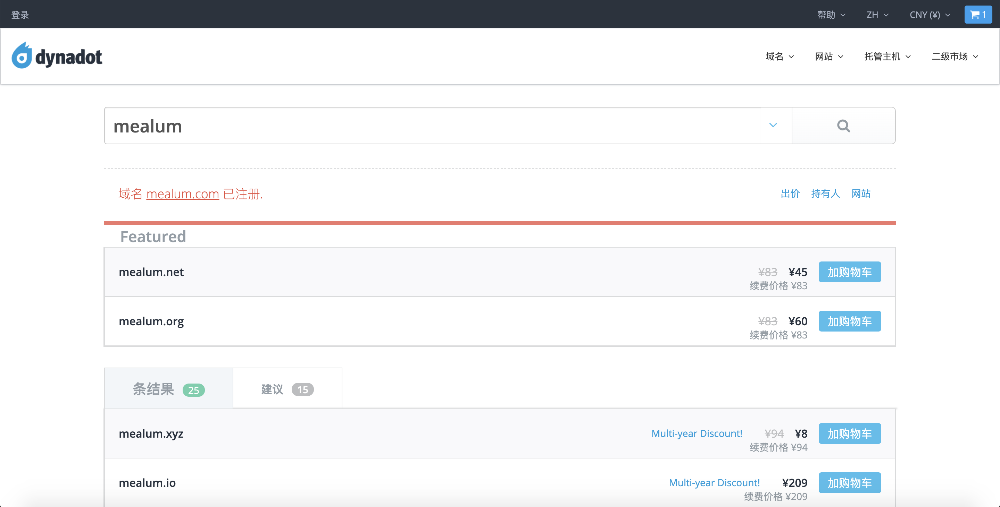
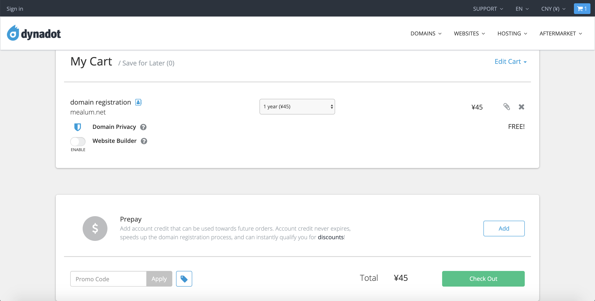
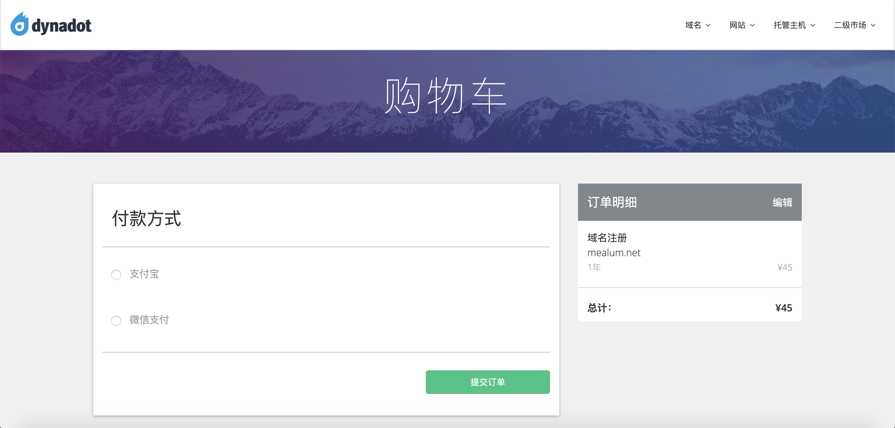
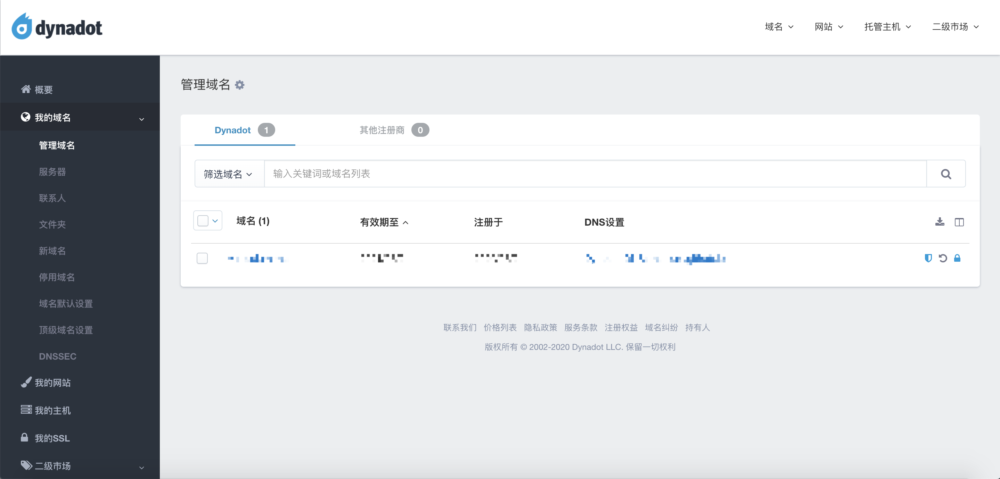
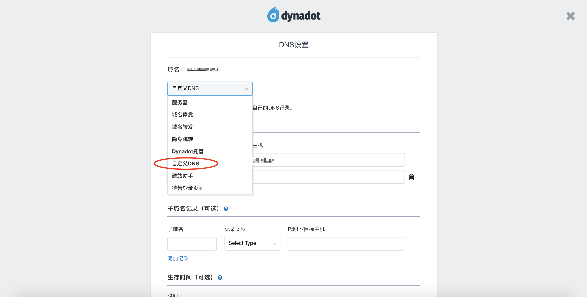
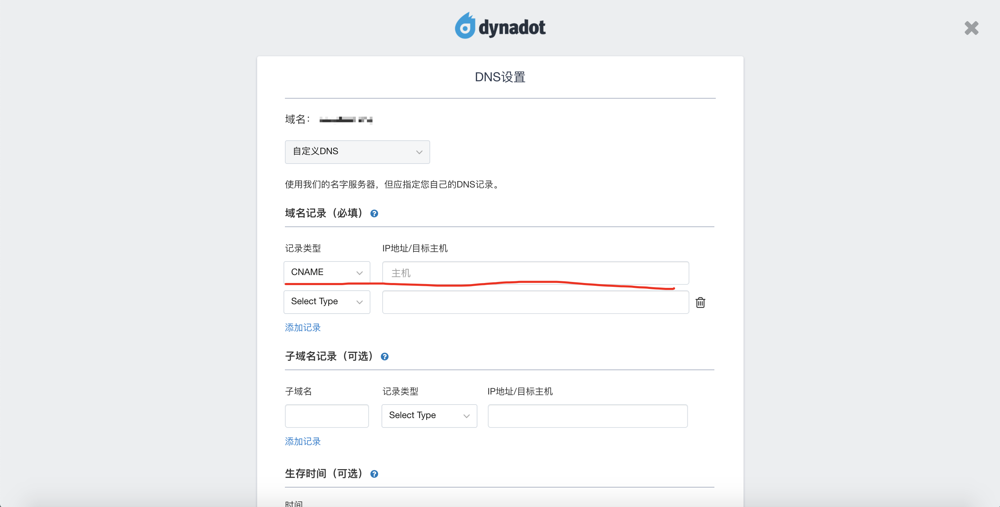
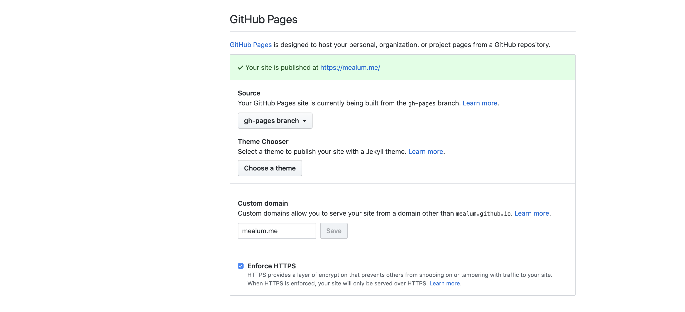

我的拖延症真是太强了...距离上次说写两篇博文已经过了一个多星期了。今天晚上还有点时间，那就先写一篇博客域名设置的博文吧。

## 闲谈

将一个博客搭建在互联网上需要两个必备条件：

1. 空间
2. 域名

其中空间用来存储网页的相关代码，而域名则为其他人提供了一个可以访问这些网页代码的指引。这篇博文主要来说说第二点，也就是域名。

个人了解比较常用的域名注册商有：

* [GoDaddy](https://sg.godaddy.com/zh)（世界最大的域名注册商，支持中文界面）
* [dynadot](https://www.dynadot.com/)（性价比较高，同样支持中文界面）
* [万网](https://wanwang.aliyun.com/)（即阿里云域名服务商，国内最好的域名服务商，注册需实名认证）
* [namecheap](https://www.namecheap.com/)（30天试用期内可退款，据说续费较贵）

由于万网不提供.me的域名注册，而同样的域名Godaddy要比Dynadot贵了将近一倍（~~也有可能是它的服务更稳定些？~~），我最后选择了性价比较高的Dynadot。

## 域名注册

进入dynadot的主页后，不必注册即可搜索期望的域名。在选好中意的域名之后进入购物车查看，然后就可以付费了。在正式付费前会要求登录/注册，完成后即可出现付款界面。

付款完成后可以在个人页面中看到已购买的域名信息。

## 域名配置

在完成了你的域名购买之后，接下来的任务就是要让它指向你网页的存储空间。我的博客托管在GitHub上，所以对于我来讲，这一步的工作就是将域名指向我个人的GitHub服务器。向下看，操作很简单。

在之前的个人页面中进入DNS设置，在第一个选项中选择“自定义DNS”。

而后在域名记录中填入一行记录。记录类型选择“CNAME”，目标主机选择你网页所存放的主机域名或主机IP地址，我的网站托管在GitHub的个人主页上，这里填写mealum.github.io即可。注意这里填写的是主机名，不能写到GitHub中某个具体的仓库名哦（比如mealum.github.io/mealum这种写法是不可以的）。

点击保存，你的域名配置就完成了！

但是，这还没有结束！

## GitHub域名配置

我们现在已经将购买好的域名指向了自己的GitHub主页，访问域名即访问该主页。但是现在直接访问GitHub主页是无法转到我们购买的域名下的。

想要实现访问GitHub主页自动转到自己的域名下也非常简单，首先打开GitHub个人主页所存放仓库的设置界面，向下翻看到GitHub Pages的相关设置，在Custom domain中填入你的域名，点击保存，稍等片刻刷新页面，待到GitHub Pages设置下出现了“Your site is published at ……”的绿色字样时就代表你已经成功了！还等什么，点击你的域名试试吧！

