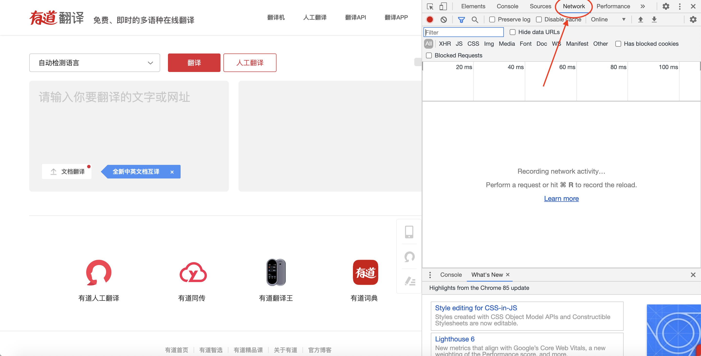
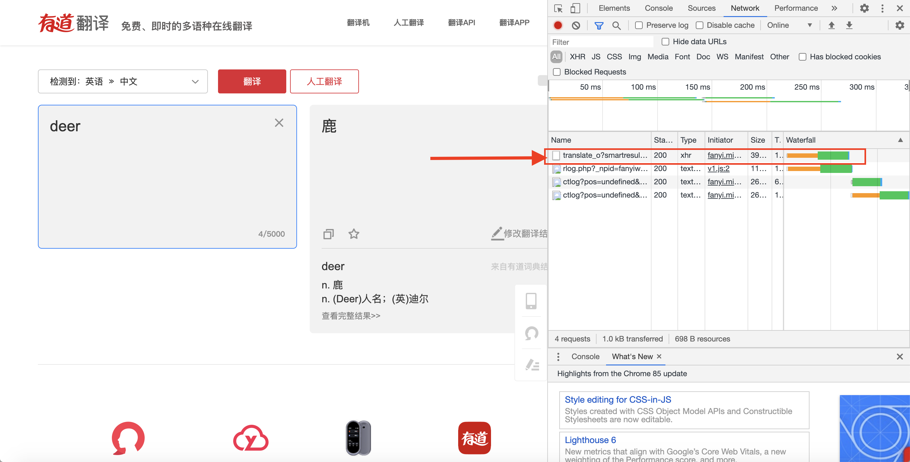
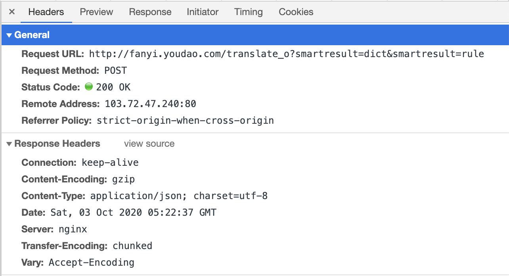
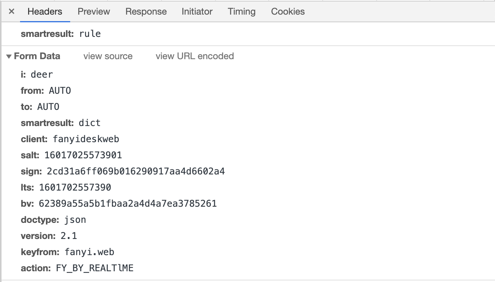
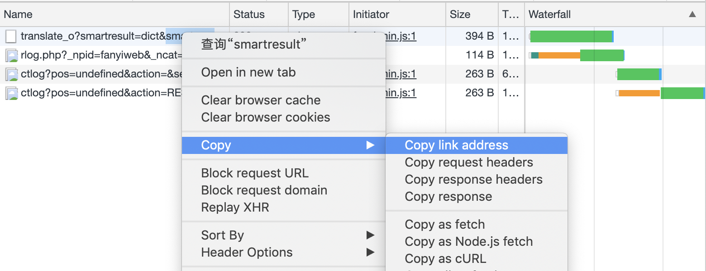

弥鹿的从零学习python爬虫教程（三）——把它“post”出去吧！


##### 本节所需：

- requests库
- 一个可以接收信息的网站

---

> post就像寄信一样，你把信件包装好寄出，之后等待着可能出现的对方的回信。
>
> <p align="right">——弥鹿的总结</p>


我们将以[有道翻译](http://fanyi.youdao.com/)为例，从信件往来的四个步骤（写信、包装信封、寄信、收信）来介绍post方法的具体应用

<!--more-->

### 写信

在开始编写代码之前，让我们打开有道翻译的页面看看它是如何工作的。

首先，在进入有道翻译页面后，我们需要打开页面检查工具，并选择其中的**Network**项，如下图。



网页检查工具的**Network**项可以清晰地记录你打开该项之后所请求的所有页面资源，这时我们在网页的翻译框中输入一个英文单词，看看右边的检查工具会有怎样的变化呢？



可以看到，在输入了一个单词后，网页共请求了4个资源，我们单击其中的第一个也就是以*translate*开头的资源项，可以发现右侧显示出了我们请求该资源的**Headers**，也就是**请求头**。其中存放了我们请求该资源所需要的信息，对应在本翻译页面来说，也即存储了我们请求获得翻译结果所需要的信息。



在**Headers**中一直向下翻阅，我们可以看到**From Data**一项，这其中便是存放我们需要post出去的信息，找找看，我们刚刚写的单词在哪里呢？



可以联想到的是，这个**From Data**项也就对应了我们写信的内容。在找到了写信的内容后，我们就需要把内容打包成一封信，打开你的python运行环境，让我们继续！

### 包装信封

```python
import requests

fromdata = {
  "i": "deer", 
  "from": "AUTO", 
  "to": "AUTO", 
  "smartresult": "dict", 
  "client": "fanyideskweb", 
  "salt": "16017025573901",
  "sign": "2cd31a6ff069b016290917aa4d6602a4",
  "Its": "1601702557390", 
  "bv": "62389a55a5b1fbaa2a4d4a7ea3785261", 
  "doctype": "json", 
  "version": "2.1", 
  "keyfrom": "fanyi.web", 
  "action": "FY_BY_REALTlME"
}
```

是不是很简单？我们只需要将网页检查工具中的**From Data**复制下来，在每一项打上引号最后再加一个大括号组成一个dict即可（只是打引号的工作有些费事，小伙伴们有什么更简单的方法吗？）。

### 寄信

接下来就是大家期待已久的步骤——寄信，而这一步也异常的简单，我们首先定义寄信的目的地址，还记得在网页检查工具中找到的*translate*开头的资源吗？右键点击它，选择其中的**Copy link address**项即可将该请求的目的地址复制下来；之后使用requests库中的post方法将之前打包好的信的内容一起邮寄到定义好的目的地址。



```python
url = "http://fanyi.youdao.com/translate_o?smartresult=dict&smartresult=rule" # 获取到的目的地址
response = requests.post(url, data=fromdata) # 使用requests库中的post方法
```

### 收信

现在我们要看看对方收到我们的信件后给我们作出了怎样的回应

```python
print(response.text)
```

哎？你是不是也收到了一条`{"errorCode":50}`的json格式的回信呢？你可能想问，为什么我没有收到我想要的翻译结果呢？没错，这也是我当时的困惑。万能的百度告诉我们这是有道词典的反爬虫机制在作怪，我想这应该和我们信的内容中的时间戳有关，后台服务器验证出了其中存在的问题当然就不会给我们一个正确的回复啦。

那就没有办法获得翻译结果了吗？

办法是有的，而且很简单！你只需要将url中的`translate_o`改为`translate`，再次运行一遍程序，就可以看到想要的翻译结果啦。而且你还可以将结果中的无用部分剔除：

```python
import json

content = json.loads(response.text)
print(content["translateResult"][0][0]["tgt"])
```


到此为止，你已经完成了第一个简单而实用的post程序。怎么样，爬虫的世界有趣吗！


*弥鹿lum*

*版权所有，未经许可，禁止转载*

